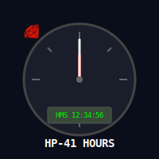

# HP-41_HOURS.rb

 A tool to update and read the HP-41 HOURSF file (hours registration for consultants)

## NAME
HP-41_HOURS.rb - A tool to update read the HP-41 HOURSF file from the program "HOURS" from the HP-41 ISENE ROM (https://github.com/isene/hp-41_isene-rom) or the more advanced stand-alone HOURS program (https://github.com/isene/hp-41_hours).

## SYNOPSIS
HP-41_HOURS.rb [-fvh] [long-options] [LIFimageFILE]

## DESCRIPTION
Reads and output the content of the HOURSF file residing in the LIF image file, "41.lif" to standard output and to the file, "hours.txt"

## OPTIONS
-f, --file	Specify the lifimage file where HOURSF resides

-h, --help Show this help text

-v, --version Show the version of HP-41_HOURS.rb

## License
This software is released into the Public Domain.

